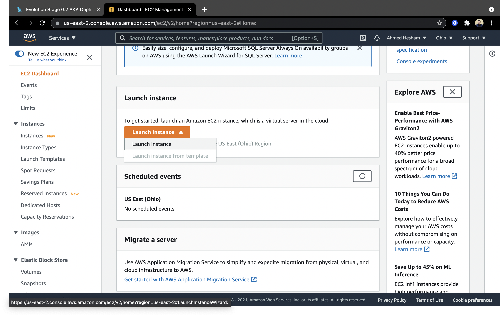
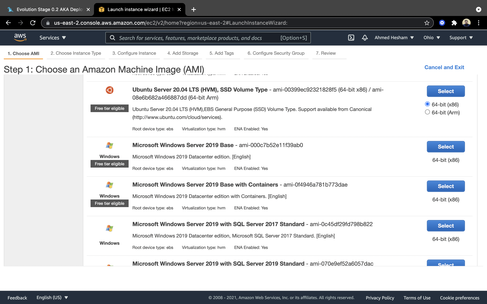
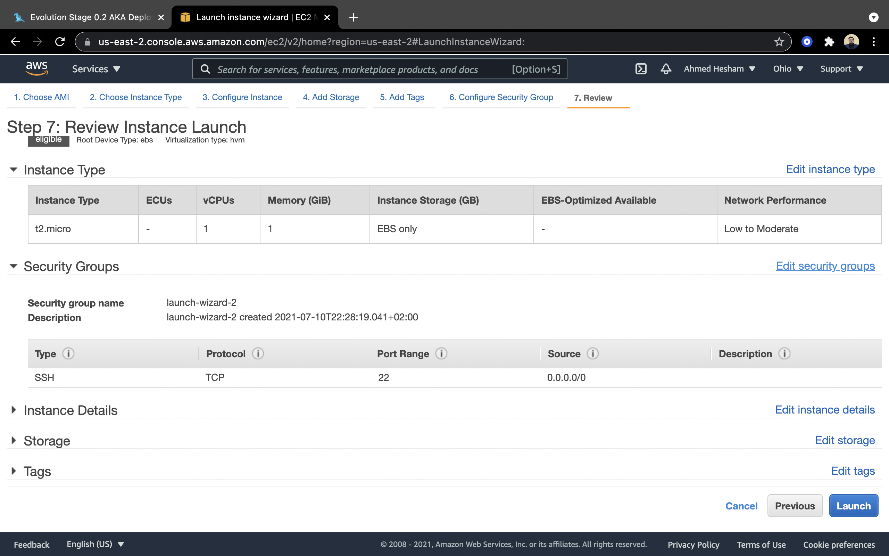
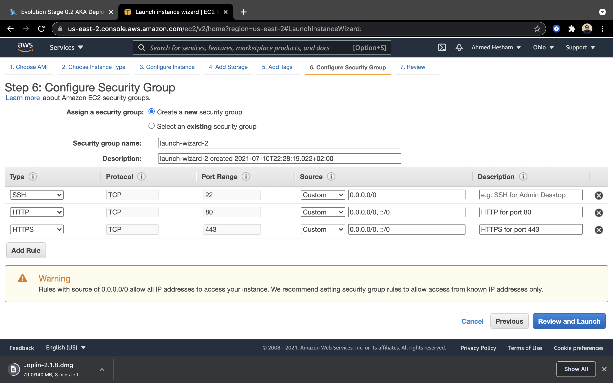
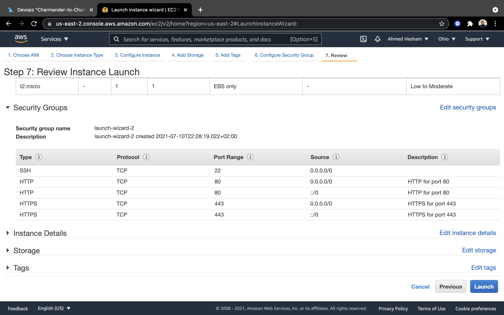

# Deployment

### Creating an instance

After creating an account on AWS free tier

- Go to EC2 page and launch an instance

- Select Ubuntu Server 20.04 LTS (Free tier eligible)

- Choose the default instance type then Review and Launch

- Go to Edit security groups to allow `http` and `https` inbound connections to the server 

- We review instance one last time before launching

### Connecting to instance

### Installing Postgres

### Installing Nginx

### Cloning the Project

### Installing Uvicorn

### Creating Service

### Load Testing Configuration

### Load Testing Report

